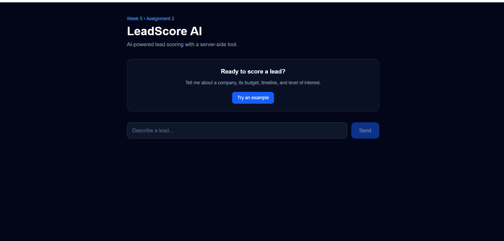
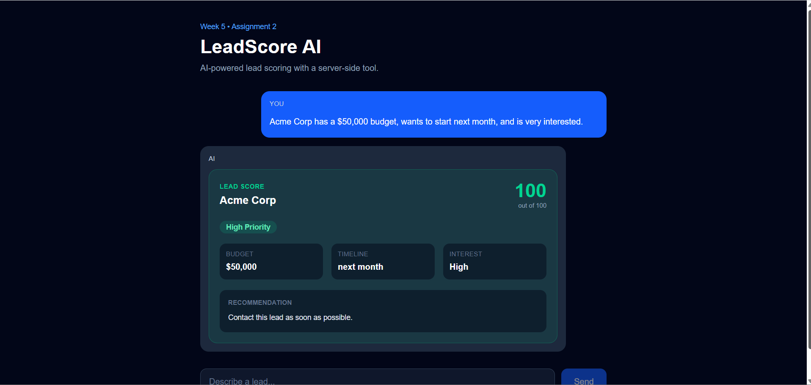
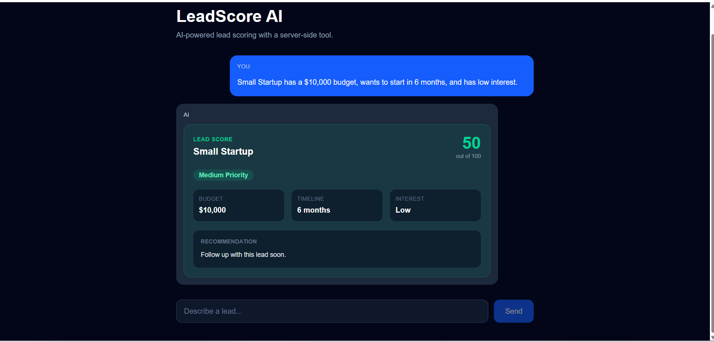

# LeadScore AI

LeadScore AI is an AI-powered lead scoring application built with Next.js, TypeScript, and the AI SDK.

It allows users to describe a sales lead in natural language. The AI extracts the relevant lead information and uses a server-side `scoreLead` tool to calculate a score based on budget, timeline, and interest.

The result is displayed as a clear lead score card with a priority level and recommended follow-up action.

## Live Demo

**Production URL:**
https://leadscore-ai-hwz6.vercel.app/

**GitHub Repository:**
https://github.com/Kirpa-Keswani/leadscore-ai

**Demo Video:**
https://drive.google.com/file/d/11qJuDuuovc-LOjzFZGhheyW8vg0NK59M/view?usp=drive_link

---

## Screenshots

### Main Interface



### High-Priority Lead



### Different Lead Result



---

## Who It's For

LeadScore AI is designed for sales teams, small businesses, and anyone who needs a quick way to prioritize potential customers.

It helps turn a natural-language description of a lead into:

* A lead score
* A priority level
* Key lead information
* A recommended follow-up action

---

## Features

* AI-powered lead scoring
* Natural-language lead input
* Server-side AI SDK tool
* Zod schema for structured tool input
* Streaming AI responses
* Structured lead score card
* Tool error handling
* Responsive interface
* Production API input limits
* Streaming request timeout

---

## Tech Stack

* **Next.js 16.3.1**
* **React 19.2.8**
* **TypeScript**
* **Tailwind CSS**
* **AI SDK**
* **Google AI SDK**
* **Gemini 3.6 Flash**
* **Zod**
* **Vercel**

---

## How It Works

A user describes a lead in normal language.

For example:

> Acme Corp has a $50,000 budget, wants to start next month, and is very interested.

The AI uses the server-side `scoreLead` tool to structure the information and calculate the lead score.

The application then displays the result as a lead score card.

```text
User
  ↓
Next.js / React UI
  ↓
Chat API Route
  ↓
Google Gemini Model
  ↓
scoreLead Server-Side Tool
  ↓
Score + Priority + Recommendation
  ↓
Structured Lead Score Card
  ↓
User
```

---

## Tool Contract

### Tool Name

`scoreLead`

### Purpose

The `scoreLead` tool calculates a lead score from 0 to 100 using budget, timeline, and interest.

### Input Schema

```text
company: string
budget: number
timeline: string
interest: "low" | "medium" | "high"
```

### Example Input

```json
{
  "company": "Acme Corp",
  "budget": 50000,
  "timeline": "next month",
  "interest": "high"
}
```

### Return Shape

```text
company: string
score: number
priority: string
budget: number
timeline: string
interest: string
recommendation: string
```

### Example Result

```json
{
  "company": "Acme Corp",
  "score": 100,
  "priority": "High",
  "budget": 50000,
  "timeline": "next month",
  "interest": "high",
  "recommendation": "Contact this lead as soon as possible."
}
```

---

## How Scoring Works

The scoring system uses three factors.

### Budget

* $50,000 or more → 40 points
* $20,000–$49,999 → 25 points
* Below $20,000 → 10 points

### Interest

* High → 30 points
* Medium → 20 points
* Low → 10 points

### Timeline

A timeline containing `"now"` or `"month"` is treated as urgent.

* Urgent timeline → 30 points
* Other timeline → 15 points

### Priority

* 75–100 → High
* 50–74 → Medium
* Below 50 → Low

The maximum possible score is 100.

---

## Production Protection

Because the application uses an AI API, the API route includes basic protection against unnecessarily large requests.

The `/api/chat` route currently:

* Limits requests to a maximum of **20 messages**
* Limits each message object to approximately **2,000 characters**
* Uses a **30-second `maxDuration`** for streaming requests
* Rejects invalid or oversized requests with a `400` response

These limits help reduce unnecessary API usage and prevent trivial abuse of the AI route.

This is basic protection rather than a full user-based rate-limiting system. A future version could add authentication and IP/user-based rate limiting.

---

## Project Structure

The main project structure is:

```text
leadscore-ai/
├── app/
│   ├── api/
│   │   └── chat/
│   │       └── route.ts
│   └── ...
├── lib/
│   └── lead-tool.ts
├── public/
├── .env.local
├── .gitignore
├── package.json
├── next.config.ts
└── README.md
```

The main AI route is:

```text
app/api/chat/route.ts
```

The lead scoring logic is kept in:

```text
lib/lead-tool.ts
```

Keeping the scoring logic in a separate server-side tool makes it easier to maintain and keeps the scoring rules separate from the user interface.

---

## Setup

### Requirements

You need:

* Node.js
* npm
* A Google AI API key

### 1. Clone the Repository

```bash
git clone https://github.com/Kirpa-Keswani/leadscore-ai.git
cd leadscore-ai
```

### 2. Install Dependencies

```bash
npm install
```

### 3. Create the Environment File

Create a `.env.local` file in the project root.

Add your Google AI API key:

```env
GOOGLE_GENERATIVE_AI_API_KEY=your_api_key_here
```

Keep this key private.

Do not commit `.env.local` to GitHub.

### 4. Start the Development Server

```bash
npm run dev
```

Open:

```text
http://localhost:3000
```

### 5. Create a Production Build

To verify the project builds successfully:

```bash
npm run build
```

---

## Environment Variables

| Variable                       | Required | Description                                |
| ------------------------------ | -------- | ------------------------------------------ |
| `GOOGLE_GENERATIVE_AI_API_KEY` | Yes      | API key used to access the Google AI model |

The API key is stored as an environment variable and is not included in the source code.

---

## Usage

Enter a lead description in natural language.

Example:

> Acme Corp has a $50,000 budget, wants to start next month, and is very interested.

The application sends the request to the server-side chat route.

The AI then uses the `scoreLead` tool and returns structured information.

The interface displays:

* Company
* Lead score
* Priority
* Budget
* Timeline
* Interest
* Recommendation

---

## Evaluation Results

I tested LeadScore AI with five different lead profiles to check how it handled different budgets, timelines, and interest levels.

| Test | Company       |  Budget | Timeline   | Interest |   Score | Priority | Result |
| ---- | ------------- | ------: | ---------- | -------- | ------: | -------- | ------ |
| 1    | Acme Corp     | $50,000 | Next month | High     | 100/100 | High     | Pass   |
| 2    | Small Startup | $10,000 | 6 months   | Low      |  35/100 | Low      | Pass   |
| 3    | TechFlow      | $30,000 | 2 months   | High     |  85/100 | High     | Pass   |
| 4    | Demo Company  | $20,000 | 3 months   | Medium   |  75/100 | High     | Pass   |
| 5    | BudgetCo      |  $5,000 | 12 months  | Low      |  35/100 | Low      | Pass   |

### Overall Result

**5 out of 5 tests passed — 100% pass rate.**

The evaluation covered different budget levels, all three interest levels, and different timeline values.

The production application was also tested using the Acme Corp example and successfully returned a **100/100 High Priority** result.

---

## Design Decisions

### Server-Side Scoring Tool

The lead scoring logic is kept inside a server-side tool instead of placing the scoring rules directly in the frontend.

I chose this approach because it keeps the scoring logic separate from the UI and prevents the client from directly controlling the scoring process.

It also makes the scoring rules easier to maintain and change later.

### Structured Tool Input

The `scoreLead` tool uses a Zod schema to define the expected input.

This makes the tool input more predictable and reduces the chance of the model sending incorrectly structured data to the scoring logic.

### Structured UI

Instead of displaying raw JSON returned by the tool, the application converts the result into a lead score card.

This makes the result easier for a user to understand at a glance.

---

## Limitations

The current version has several limitations:

1. The scoring system uses fixed rules rather than learning from historical sales data.
2. Timeline urgency is detected using simple text matching. Timelines containing `"now"` or `"month"` are treated as urgent.
3. The score is a prioritization guide and does not guarantee that a lead will become a customer.
4. The application does not currently connect to a real CRM or sales database.
5. The result depends on the AI correctly understanding the information provided by the user.
6. The current abuse protection uses request limits rather than full user-based rate limiting.

### Possible Improvements

A future version could:

* Connect to a CRM
* Use historical sales data
* Improve timeline understanding
* Add lead history and tracking
* Add authentication
* Add user-based rate limiting
* Provide analytics
* Allow feedback to improve the scoring system

---

## How AI Tools Helped Build This

I built LeadScore AI with assistance from AI development tools, including Claude.

AI was used as a development partner during several parts of the project, including:

* Planning the application structure
* Understanding and implementing AI SDK patterns
* Writing and refining parts of the code
* Debugging TypeScript and Next.js issues
* Troubleshooting API and deployment problems
* Improving the README and project documentation
* Reviewing possible implementation approaches

I did not rely on generated code without testing it. I personally ran the application, reviewed the implementation, tested different lead profiles, checked the production deployment, and verified the resulting scores.

The final application was tested locally and on the public production deployment.

---

## Demo

A 3–5 minute demonstration video accompanies this project as part of the FlyRank assignment.

The demo shows:

* The application running live
* A complete lead-scoring flow
* AI processing the lead information
* The resulting score and recommendation
* A design decision
* A project limitation

**Demo video:** Add your video link here.

---

## Production Deployment

LeadScore AI is deployed on Vercel.

**Live application:**

https://leadscore-ai-hwz6.vercel.app/

The production environment contains the required Google AI API environment variable, while the API key remains private and is not stored in the repository.

---

## Repository

**GitHub:**

https://github.com/Kirpa-Keswani/leadscore-ai

---

## Author

**Kirpa Keswani**

Built as part of the FlyRank Front-end AI Engineering track.
